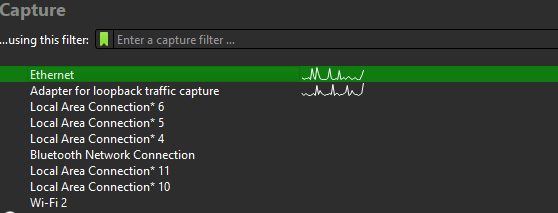
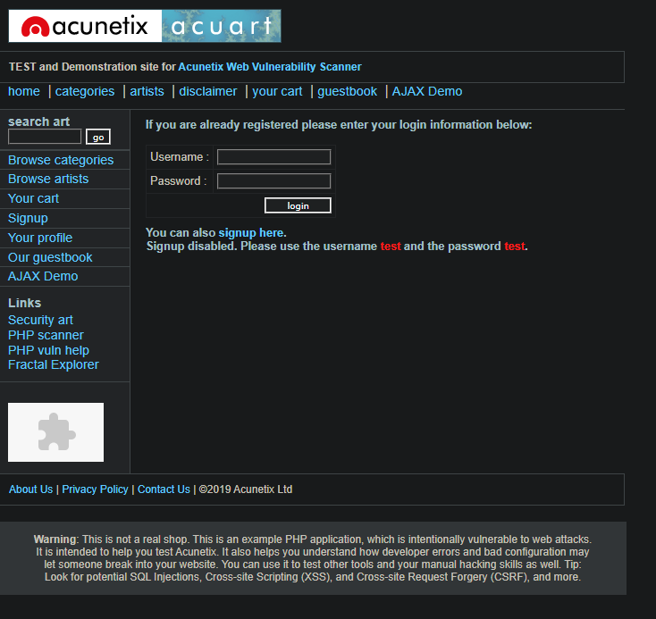
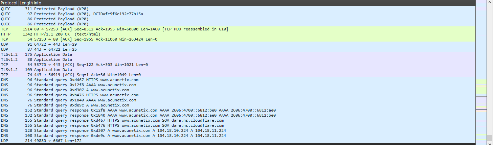
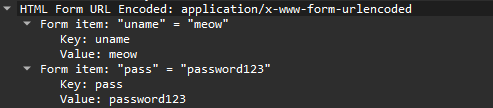
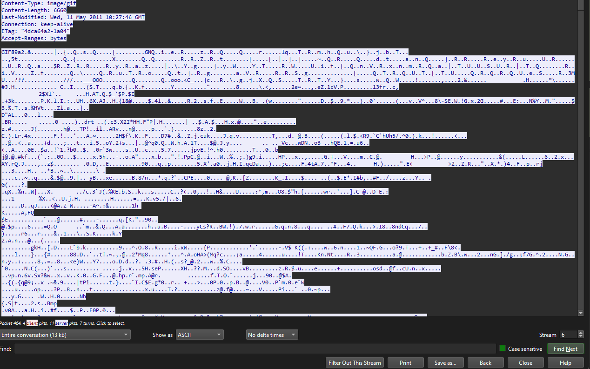

# Home Lab Report: Deep Network Traffic Analysis 

**Engineer:** Jordan Schaefer 

**System Environment:** Windows 10
 
## Summary 

In this lab the goal is to use Wireshark to perform Deep Packet Analysis. With this tool we should be able to gather the IP of either party, the data sent during the recording and be able to find a secret username and password hidden in a username and password field from a HTTP website.
  
## Infrastructure

**Software:** Wireshark, Google

**Concepts:** Packet Analysis, Networking, TCP/UDP, HTML, HTTP

**NOTE: Personal IP Adresses are NOT shown to retain privacy**
  
## Implementation Phases 

### Phase 0: Installation and Setup 

Started by updating Wireshark since it had an update, ensuring systems are up to date is vital for preventing vulnerabilities.

Then opened wireshark and used the ethernet data.

Figure 1: Used Ethernet Data because I use an Ethernet Cable for all of my PC's data 

Installed Wazuh Dashboard on Ubuntu machine and installed Wazuh Agent on Windows Server machine. Then proceeded with Wazuh setup process on devices.  

### Phase I: Gathering Data 

Started Wireshark monitoring and entered fake user and password on http://testphp.vulnweb.com/login.php . 

(This is a great HTTP site for testing)

  
Figure 2: testphp website for the experiment 

  
Figure 3: Lots of Wireshark Logs gathered in just a few seconds. Tedious and useless to go through manually.

### Phase II: Deep Packet Analysis 

Filtered by POST to find only where data was being sent. Only one piece of data came back, although typically it isnt this easy to find a specific packet.

  
Figure 4: The command used to filter by POST 

  
Figure 5: The single packet found that used POST 

## Finding My Inputted Data 

Because the website I inputted data into was HTTP and not HTTPS my password and username can be seen clear as day when doing a deep packet analysis.

  
Figure 6: My hypothetical username and password that weren't even encrypted 

Following the TCP Stream Leads me directly to the entire conversation my PC had with the unsecured website.

  
Figure 7: My hypothetical username and password that weren't even encrypted 

  
## Final Validation 

After completing the packet analysis I was successfully able to obtain the username and password I had entered into my sample HTTP site.

  
Figure 2: testphp website for the expirement 
  
## Conclusion 

This lab demonstrates the simplicity and importance of Deep Packet Analysis. It also demonstrates understanding of Networks, HTML, TCP Handshake and UDP through performing deep packet analysis on an intentionally sent http data packet.

